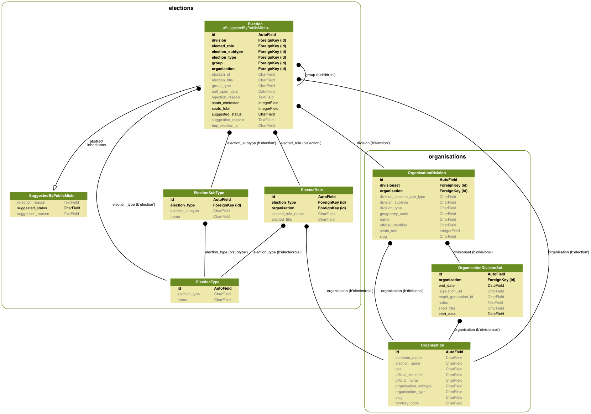

# EveryElection

For recording every election in the UK

## Domain Model

### Elections

The elections table stores a list of election objects, each with a semantic ID.

Election IDs sometimes have a parent, and are sometimes a "group ID".

There are two types of group ID:

1. `[type].[date]`, for example `local.2017-05-04` will be the group for all local elections happening on 2017-05-04.
2. `[type].[organiation].[date]`, for example `local.norfolk.2017-05-04` is the Norfolk County Council elections.

Finally an ID is made _per ballot paper_ using `[type].[organiation].[organisation division].[date]` for example `local.norfolk.diss.2017-05-04`.

[See the reference for more information](https://democracyclub.org.uk/projects/election-ids/reference/).

