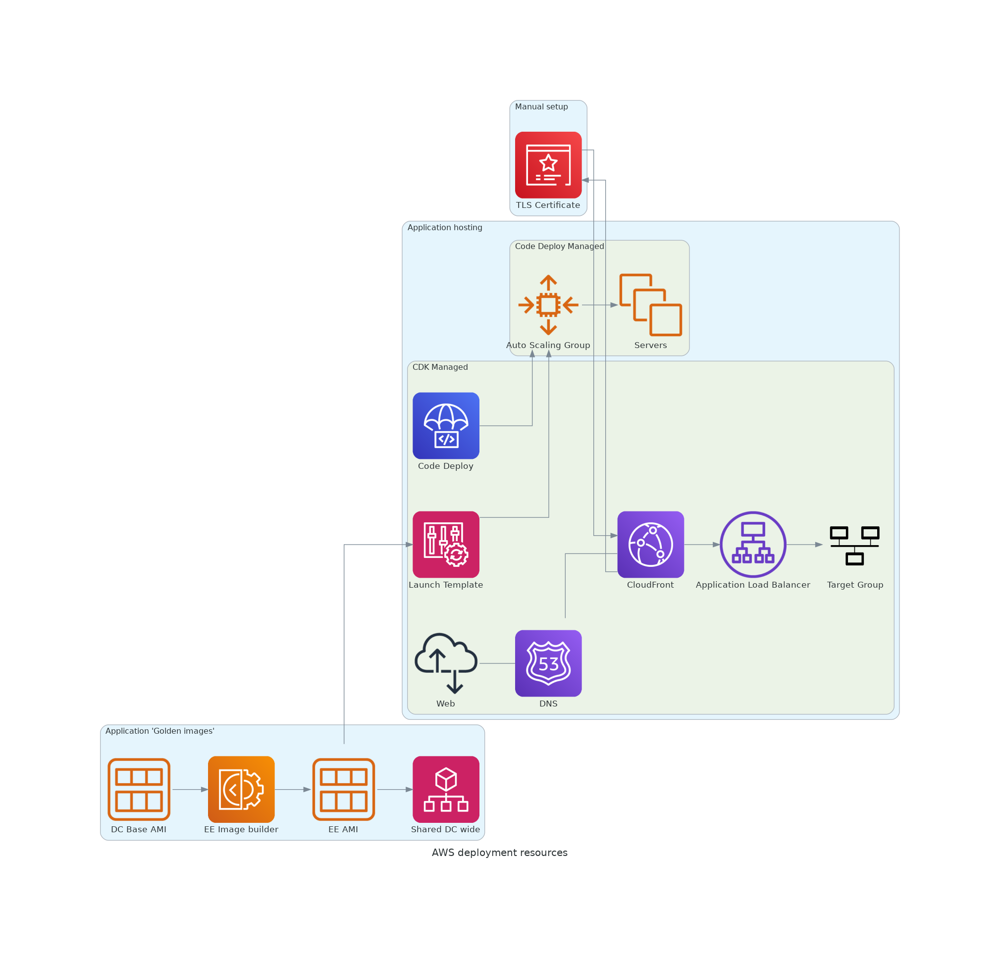

# Deployment 

This project is deployed to AWS using CircleCI.

We use AWS CDK to set up most of the application, with some initial manual set up for a new account
and some boto3 scripting for managing actual deployments.

There are a few components to the deployment:



## Application 'Golden images'

We use AWS Image Builder to generate Amazon Machine Images (AMIs) wih the application installed.

These images are based on the [DC Base Image](https://github.com/DemocracyClub/dc_image_builder) and have 
the system software, user accounts and application baked in to them.

These images are designed to be used by other projects in DC who want embedded EveryElection.

## Application hosting

We use AWS EC2 to run the application itself.

The application is written in Django and served with Gunicorn over port `8001`.

EC2 Instances are managed by a mix of CodeDeploy, a Launch Template and an Auto Scaling Group (ASG).

The process for each depoyment is:

1. Call `deployscripts/create_deployment_group.py` to create the initial deployment group
2. Call `COMMIT_SHA=[SHA] deployscripts/create_deployment.py`.
3. This will start a "Blue/Green" deployment with CodeDeploy
4. New instances will spin up according to the Launch Template
5. CodeDeploy will run the steps defined in `appspec.yaml`
6. When the instances are repoting as healthy, CodeDeploy will replace the old instances with the new ones
7. `create_deployment.py` will exit


## New account set up

Assuming you can authenticate against the account locally. If you're using  
AWS SSO then this means passing `--profile [env]-ee-dc` to CDK and other AWS CLI commands.


### bootstrap CDK

```shell

cdk bootstrap --context dc-environment=[development|staging|production]
```

CDK will create various AWS resources that are needed to deploy the stacks. This includes
an S3 bucket and some IAM roles.

See [CDK bootstrapping](https://docs.aws.amazon.com/cdk/v2/guide/bootstrapping.html) for more.


### AWS Deployment user

We need a user that can deploy the application.

Because CDK uses CloudFormation to do a lot, it's recommended that the deployment user has administrative 
access. This is typically a bad idea, but it's very hard to get CloudFormation working without it.

1. Create an IAM user called `CircleCIDeployer` in the AWS console
2. Select `Programmatic access`
3. Attach the existing `AdministratorAccess` policy
4. Continue and download the CSV with the access keys

### Domain name and TLS certificate

#### DNS
1. Make a new hosted zone in the target account
2. Delegate the NS of the intended domain to the hosted zone's name servers

#### Cert
Once the Domain nam is set up, use AWS Certificate Manager to create a cert.

NOTE: This MUST be in the `us-east-1` account to work with CloudFront. You will have to delete and re-create
the cert if you make it in the wrong region.

### AWS Parameter Store

The CDK Stack requires some parameters that are taken from the SSM Parameter Store:

* `FQDN`: the domain name you assigned above that you want to app to be serverd from
* `SSL_CERTIFICATE_ARN`: the ARN of the ACM cert you made above
* `OrganisationID` the ID of the AWS organisation this is sitting in. Used for Image Builder to share AMIs

### CircleCI context

In order for CircleCI to run deployments, we need a new context. This is a set of private 
data that Circle can inject in to jobs when they run.

We need at least the `AWS_ACCESS_KEY_ID` and `AWS_SECRET_ACCESS_KEY` values for the deployment user that you 
created.


1. In CircleCI go to "Organisation Settings" -> "Contexts"
2. Create a context called `deployment-[environment]-ee`
3. Open the context and add Environment Variables:
   * `AWS_ACCESS_KEY_ID`: from the deploy user
   * `AWS_SECRET_ACCESS_KEY`: from the deploy user
   * `AWS_REGION`: `eu-west-2` or the region you're deploying to
4. Modify the `workflows` section in `.circleci/config.yml` to use the new environment 